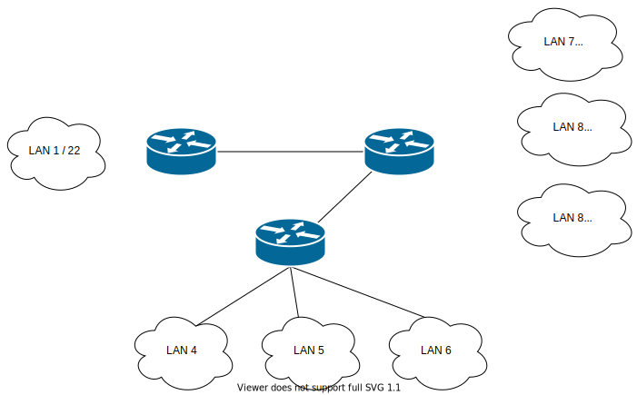

# Zadanie 2

Projekt sieci spełnił oczekiwania, organizacja po uwzględnieniu nowych wymogów chce podzielić dotychczasowe sieci na kilka podsieci.

1. Zaprojektuj oraz udokumentuj prototyp rozwiązania z wykorzystaniem oprogramowania ``CISCO Packet Tracer``, ``VirtualBox`` lub podobnego. 

## Schemat

## Charakterystyka
  * LAN 1 pozostaje bez zmian
  * LAN 2 zostaje podzielony na 3 równe podsieci
  * LAN 3 zostaje podzielony na 3 podsieci z uwzględnieniem
    * podsieć 1 ma obsłużyć do 500 hostów
    * podsieć 2 ma obsłużyć do 100 hostów
    * podsieć 3 ma obsłużyć do 80 hostów
  * Usunięty został również link pomiędzy Routerem (LAN 1) a Routerem (LAN 2)
  * Uwzględnij zmiany w tablicy routingów

## Zawartość

* Adresy poszczególnych sieci IP

    ##

    | Sieć | Adres sieci | Maska|  Zakres hostów   | Adres rozgłoszeniowy |
    | ------------ |----------- | ----------- | -----------  | ----------- |
    | **LAN 1** | ``195.225.180.0``   | `` 255.255.252.0 `` | `` 195.225.180.1 - 195.225.183.254 `` | `` 195.225.183.255 `` |
    | **LAN 2** | ``185.4.212.0`` | `` 255.255.252.0 `` | `` 185.4.212.1 - 185.4.215.254 `` | ``185.4.215.255`` |
    | **LAN 3** | ``91.201.44.0`` | `` 255.255.252.0 `` | `` 91.201.44.1 - 91.201.47.254 `` | `` 91.201.47.255 `` |
    | **LAN 4** | ``185.4.212.0`` | ``255.255.255.0``  | `` 185.4.212.1 - 185.4.212.254 `` | ``185.4.212.255`` |
    | **LAN 5** | `` 185.4.213.0 `` | ``255.255.255.0`` | ``185.4.213.1 - 185.4.213.254`` | ``185.4.213.255`` |
    | **LAN 6** | `` 185.4.214.0 `` | ``255.255.255.0`` | `` 185.4.214.1 - 185.4.214.254 ``| ``185.4.214.255`` |
    | **LAN 7** | `` 91.201.44.0 `` | `` 255.255.254.0 `` | `` 91.201.44.1 - 91.201.45.254 `` | `` 91.201.45.255 `` |
    | **LAN 8** | `` 91.201.46.0 `` | `` 255.255.255.128 `` | `` 91.201.46.1 - 91.201.46.126 `` | `` 91.201.46.127 `` |  
    | **LAN 9** | `` 91.201.46.128 `` | `` 255.255.255.128 `` | `` 91.201.46.129 - 91.201.46.254 `` | `` 91.201.46.255 `` |

* Adresacja linków pomiędzy routerami

    * link LAN 1 - LAN 3
        ## 

        | Sieć | Adres | Maska|
        | ------------ |----------- | ----------- |
        | **LAN 1 ip_2** | ``20.10.0.5``| `` 255.255.255.252 `` |
        | **LAN 3 ip_2** | ``20.10.0.6``| `` 255.255.255.252 `` |
    
    * link LAN 2 - LAN 3
        ## 

        | Sieć | Adres | Maska|
        | ------------ |----------- | ----------- |
        | **LAN 2 ip_3** | ``20.10.0.9`` | `` 255.255.255.252 `` |
        | **LAN 3 ip_2** | ``20.10.0.10``| `` 255.255.255.252 `` |

* Tablica routingów na poszczególnych routerach

    * Tablica routingu sieci **LAN 1** 
        ## 

        | Network |  Destination address | Mask| Next hoop|
        | ------------ |----------- | ----------- |----------- |
        | **LAN 2** | ``185.4.212.0``| `` 255.255.252.0 `` |  ``20.10.0.6`` |
        | **LAN 4** | ``185.4.212.0``| `` 255.255.255.0 `` |  ``20.10.0.6`` |
        | **LAN 5** | ``185.4.213.0``| `` 255.255.255.0 `` |  ``20.10.0.6`` |
        | **LAN 6** | ``185.4.214.0``| `` 255.255.255.0 `` |  ``20.10.0.6`` |
        | **LAN 3** | ``91.201.44.0`` | `` 255.255.252.0 ``|  ``20.10.0.6`` |
        | **LAN 7** | ``91.201.44.0`` | `` 255.255.254.0 ``|  ``20.10.0.6`` |
        | **LAN 8** | ``91.201.46.0`` | `` 255.255.255.128 ``|  ``20.10.0.6`` |
        | **LAN 9** | ``91.201.46.128`` | `` 255.255.255.128 ``|  ``20.10.0.6`` |

    * Tablica routingu sieci **LAN 2** 
        ## 

        | Network |  Destination address | Mask| Next hoop|
        | ------------ |----------- | ----------- |----------- |
        | **LAN 1** | ``195.225.180.0``| `` 255.255.252.0 `` |  ``20.10.0.9`` |
        | **LAN 3** | ``91.201.44.0`` | `` 255.255.252.0 ``| ``20.10.0.9`` |
        | **LAN 7** | ``91.201.44.0`` | `` 255.255.254.0 ``|  ``20.10.0.9`` |
        | **LAN 8** | ``91.201.46.0`` | `` 255.255.255.128 ``|  ``20.10.0.9`` |
        | **LAN 9** | ``91.201.46.128`` | `` 255.255.255.128 ``|  ``20.10.0.9`` |

    * Tablica routingu sieci **LAN 3** 
        ## 

        | Network |  Destination address | Mask| Next hoop|
        | ------------ |----------- | ----------- |----------- |
        | **LAN 1** | ``195.225.180.0``| `` 255.255.252.0 `` |  ``20.10.0.5`` |
        | **LAN 2** | ``185.4.212.0`` | `` 255.255.252.0 ``| ``20.10.0.10`` |
        | **LAN 4** | ``185.4.212.0``| `` 255.255.255.0 `` |  ``20.10.0.10`` |
        | **LAN 5** | ``185.4.213.0``| `` 255.255.255.0 `` |  ``20.10.0.10`` |
        | **LAN 6** | ``185.4.214.0``| `` 255.255.255.0 `` |  ``20.10.0.10`` |
